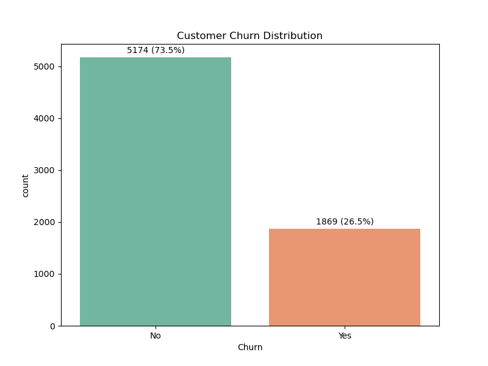
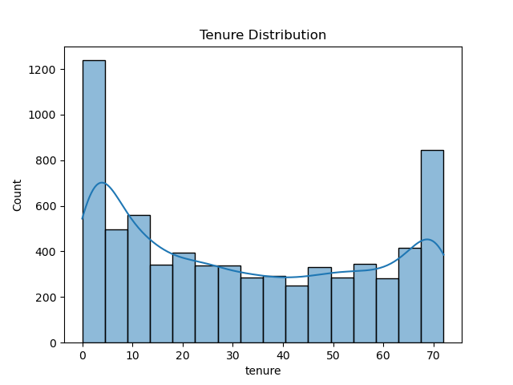
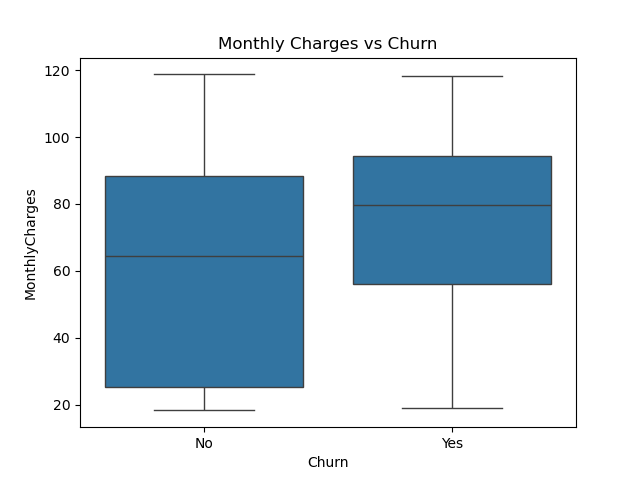

# Telco Customer Churn – Cleaning, EDA & Preprocessing

This project performs data cleaning, exploratory data analysis (EDA), and preprocessing on the **Telco Customer Churn dataset** to prepare it for machine learning.
---

## Dataset Summary
- **Rows:** 7,043
- **Target:** `Churn` (Yes/No)
- **Features:** Demographics, service usage, contract types, billing.
---

## Step 1: Load & Inspect

- Loaded dataset from CSV
- Found 7,043 rows and 21 columns
- Checked for nulls, data types, and sample values
---

## Step 2: Data Cleaning

- Converted `TotalCharges` to float
- Checked for duplicates
- Dropped `customerID` (non-predictive)
---

## Step 3: EDA – Target and Numeric Features

- **Churn:** 26% churn rate, slight imbalance
- **Tenure:** - Mid-range tenure (20–60 months) has fewer customers—maybe a good place to look for churn risks
- **MonthlyCharges:** Churners pay slightly more per month

