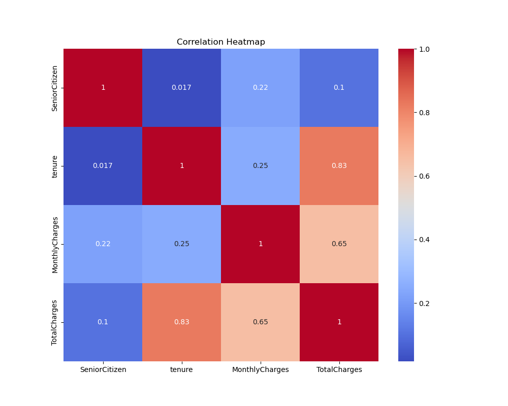

# Telco Customer Churn – Cleaning, EDA & Preprocessing

This project performs data cleaning, exploratory data analysis (EDA), and preprocessing on the **Telco Customer Churn dataset** to prepare it for machine learning.
---

## Dataset Summary
- **Rows:** 7,043
- **Target:** `Churn` (Yes/No)
- **Features:** Demographics, service usage, contract types, billing.
---

## Load & Inspect

- Loaded dataset from CSV
- Found 7,043 rows and 21 columns
- Checked for nulls, data types, and sample values
---

## Data Cleaning

- Converted `TotalCharges` to float
- Checked for duplicates
- Dropped `customerID` (non-predictive)
---

## EDA – Target and Numeric Features

- **Churn:** 26% churn rate, slight imbalance

- **Tenure:** - Mid-range tenure (20–60 months) has fewer customers—maybe a good place to look for churn risks

- **MonthlyCharges:** Churners pay slightly more per month

---

## Correlation & Contract Analysis

- Customers with longer `tenure` are less likely to `Churn`, indicating a negative correlation between
- Strong positive correlation between `TotalCharges` and `MonthlyCharges`, which makes sense, since TotalCharges are typically accumulated over time based on monthly billing.

- Customers with Month-to-month contracts show the highest churn rate.
- over 47% of churned customers are on Month-to-month contracts, while churn among Two-year contract holders is very minimal

---

## Outlier Detection and Removal

We visualized and removed outliers from key numeric columns using the IQR method.

- `tenure` had a clean distribution (little change)

- `MonthlyCharges` had some high outliers removed

- `TotalCharges` was skewed with several heavy outliers

---

## Categorical Feature Encoding

We encoded categorical variables to make the dataset fully numeric and ML-ready:

### Binary Feature Encoding
The following binary categorical columns were encoded using `LabelEncoder`:

- `gender` (Female=0, Male=1)
- `Partner` (No=0, Yes=1)
- `Dependents` (No=0, Yes=1)
- `PhoneService` (No=0, Yes=1)
- `PaperlessBilling` (No=0, Yes=1)
- `Churn` (No=0, Yes=1)

This approach ensures consistent, reproducible label encoding that can be saved and applied in future pipelines.

### One-Hot Encoding for Multi-class Features
We used `pd.get_dummies()` with `drop_first=True` for the following features:

- `MultipleLines`
- `InternetService`
- `OnlineSecurity`
- `OnlineBackup`
- `DeviceProtection`
- `TechSupport`
- `StreamingTV`
- `StreamingMovies`
- `Contract`
- `PaymentMethod`

This avoids the dummy variable trap while retaining full interpretability.
---

## Feature Scaling

- Standardized `tenure`, `MonthlyCharges`, and `TotalCharges`
- Normalized values are centered with mean=0 and std=1
---

## Final Dataset Ready

- Cleaned, encoded, and scaled
- Shape: [7032 rows × 31 columns]
- No missing values. Ready for modeling!